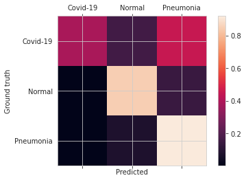
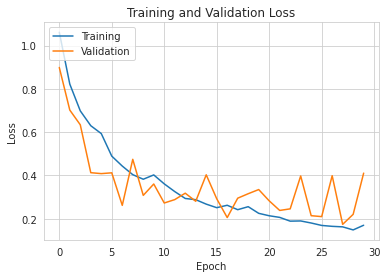
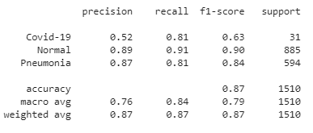

# Model and Hyper-parameters

<!-- Model -->
## Lenet adaptation Model with standard dataset
 Lenet arquitecture:
    
    - Two sets: *Convolutional Layers* and *Pooling Layers*
    - One *Flattening Convolution Layer*
    - Two *Fully-Connected Layers*
    - A *softmax* classificator
    
Link to access the model weights: https://drive.google.com/drive/folders/1-4obi-MsizDWPX1Z3kVSlrAD6OrPNMjB?usp=sharing

### Results

#### Classification Report

#### Confusion Matrix

## Lenet adaptation Model with balanced dataset

 Lenet arquitecture:
    
    - Two sets: *Convolutional Layers* and *Pooling Layers*
    - One *Flattening Convolution Layer*
    - Two *Fully-Connected Layers*
    - A *softmax* classificator

Learning Rate of 0.0001 using Adam, with decaying callback on keras.

Link to access the model weights: https://drive.google.com/drive/folders/1l6mpkca7rDe3-FzY2ZKLctroQEQOoFs2?usp=sharing

### Results

#### Classification Report

#### Confusion Matrix

# Conclusion

After several attemps trying to make a neural network with the Lenet architecture based of different settings, ranging from dropouts to learning rates or even different layers, the best attemp was the last one of this document (with the balanced dataset).
Even tho the results were good, it still had problems distinguishing between Covid-19 and Pneumonia (similiar to other architectures explored).

