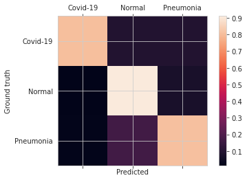

# Model and Hyper-parameters

<!-- Model -->

## Model with balanced dataset

 Lenet arquitecture:
    
    - Two sets: *Convolutional Layers* and *Pooling Layers*
    - One *Flattening Convolution Layer*
    - Two *Fully-Connected Layers*
    - A *softmax* classificator

Learning Rate of 0.0001 using Adam, with decaying callback on keras.

Link to access the model weights: https://drive.google.com/drive/folders/1-G6dT_a3ZxD6INWP_PAIcCN5sBH-Yjcn?usp=sharing

### Results

#### Confusion Matrix

#### Classification Report

The increase of complexity after the vgg19 model didn't increase it's performance, so we decided to keep it simple (as it was demonstrated here).

# Conclusion

The increase of epochs and the change of learning rate or complexity of the final end of the model proved to perform equal or worst in training than the current setup.
It appears that, like the __VGG16__ and others, the model still lacks enough data to fully understand the COVID-19 cases, leading the model to eventually overfit on the training data, leading to bad results. Even so, before the model enters in overfit, we managed to score a recall (aka *Sensitivity*) of around 68% on the COVID-19 cases and above 85% for the others.
