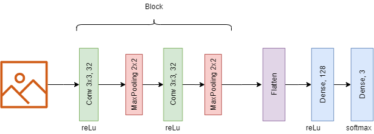
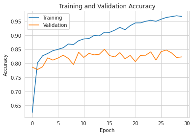
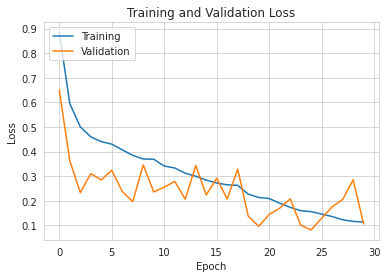

# Model and Hyper-parameters

The SCNN- *x*Block model - Simple Covid Neural Network with __x__ blocks - was designed with the objective of being simple and efficient at analyzing chest x-rays. 
The architecture is composed of the following:

## SCNN Model with balanced dataset, SCNN-1Block
    
Link to access the model weights: https://drive.google.com/drive/folders/1-3NdJBOLZVh9sbTva8srQLtdrCfLhcKY?usp=sharing

### Results

#### Classification Report
 
    

#### Confusion Matrix

Link to access the model weights: https://drive.google.com/drive/folders/1oVuymbP1irJu65j8bDx-sjjbMQW0V_tY?usp=sharing

## SCNN Model with balanced dataset, SCNN-2Block

### Results

#### Classification Report

#### Confusion Matrix

# Conclusion

This architecture was developed with simplicity in mind, given the not so good results on the bigger models. As such, starting really simple, we hoped the increase of CNN's blocks would improve performance to a certain point, staying at 2 blocks.
Maybe with a bigger dataset, the results would be better.

